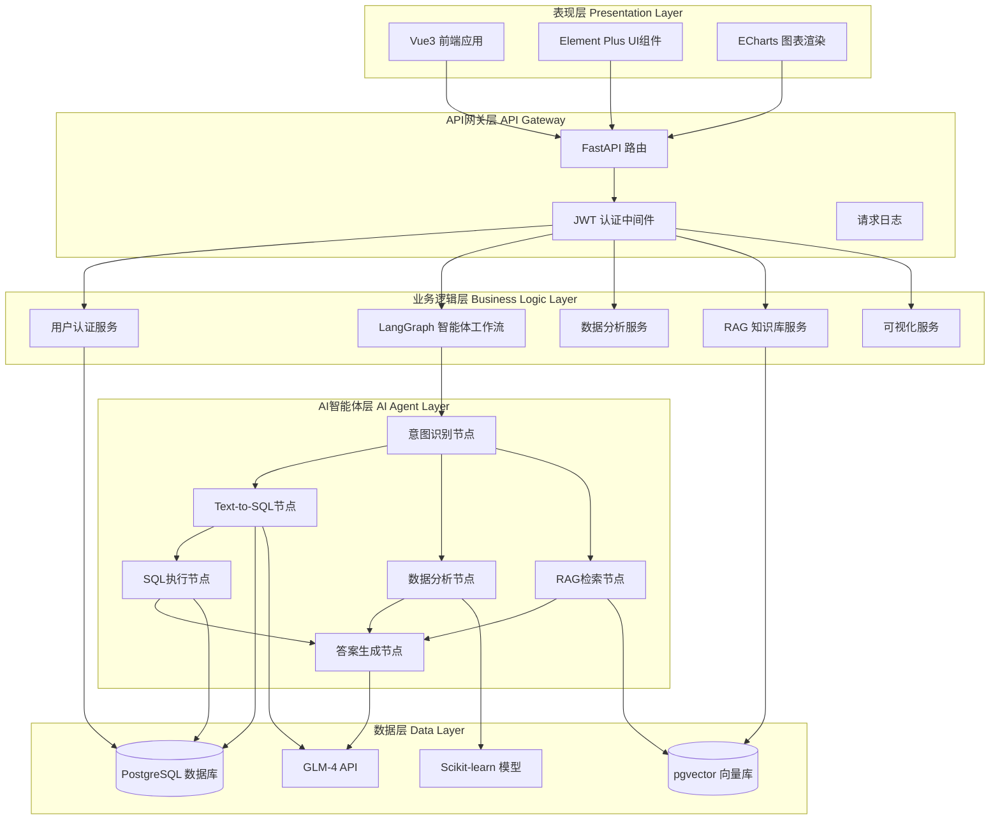
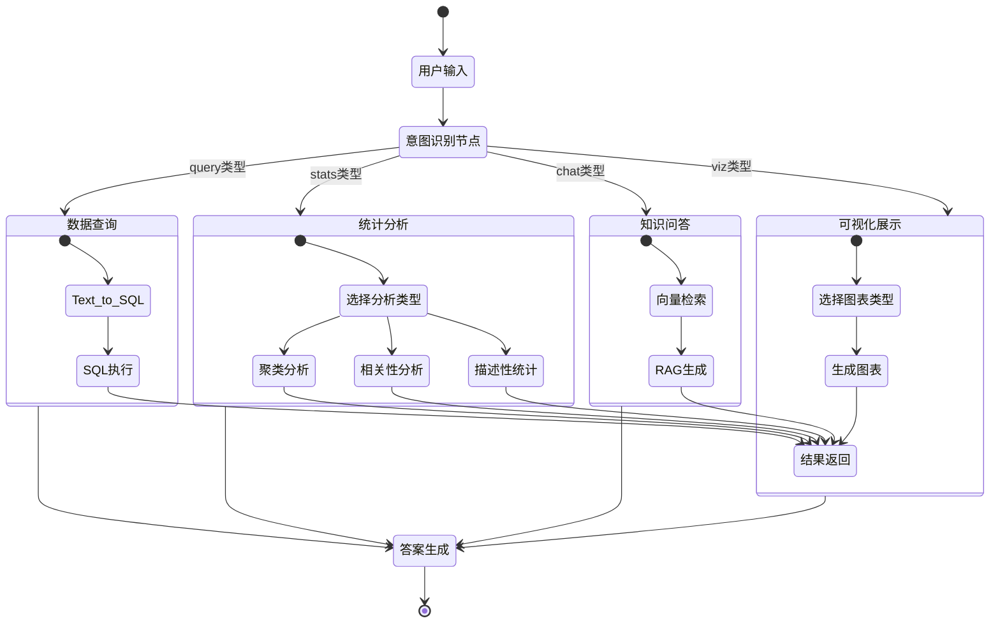
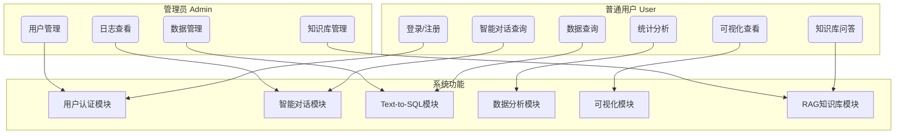
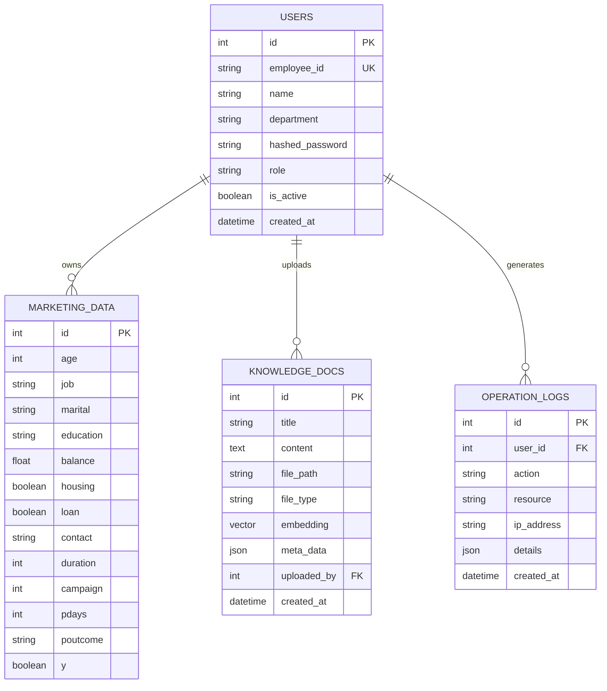
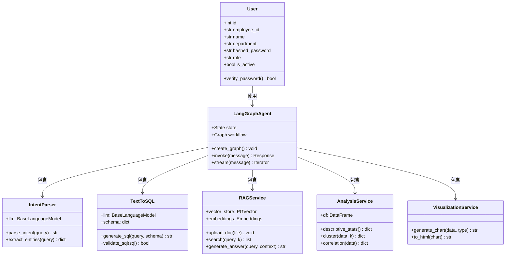
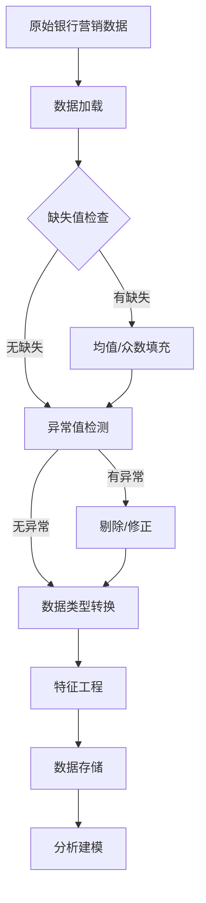
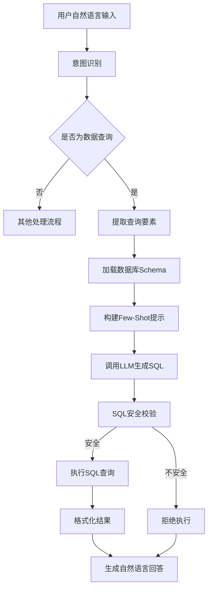
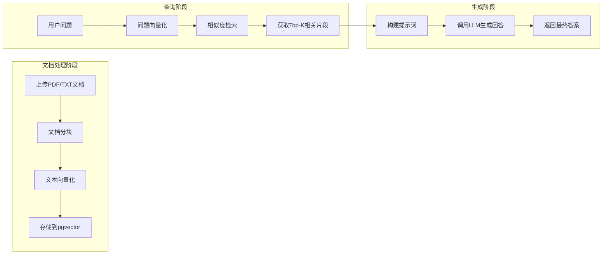
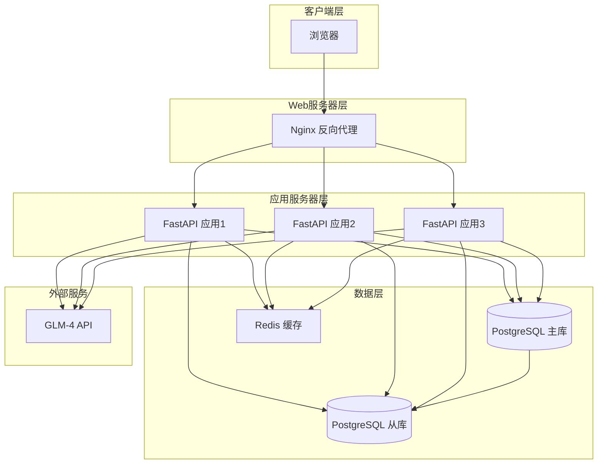

# BankAgent-Pro 论文UML图代码

> 以下代码可以复制到 https://mermaid.live/ 或 https://plantuml.com/ 在线渲染

---

## 1. 系统总体架构图

---

## 2. LangGraph智能体工作流图

---

## 3. 系统用例图

---

## 4. 数据库E-R图

---

## 5. 核心类图

---

## 6. 数据处理流程图

---

## 7. Text-to-SQL处理流程图

---

## 8. RAG检索增强生成流程图

---

## 9. 系统部署架构图

---

## 使用说明

### Mermaid在线渲染
1. 访问 https://mermaid.live/
2. 将代码复制到左侧编辑框
3. 右侧实时预览效果
4. 点击 Download PNG 下载图片

### PlantUML在线渲染
1. 访问 http://www.plantuml.com/plantuml/uml/
2. 将代码复制到输入框
3. 点击 Submit 生成图片

### 论文中插入图片
1. 生成PNG格式图片
2. 在Word中使用"插入 -> 图片"
3. 添加图注，如"图4-1 系统总体架构图"
